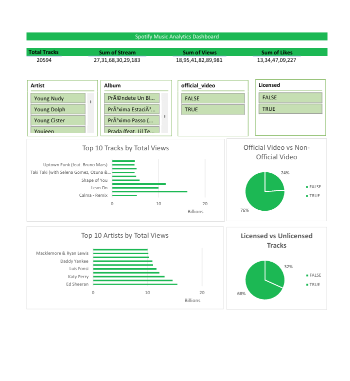
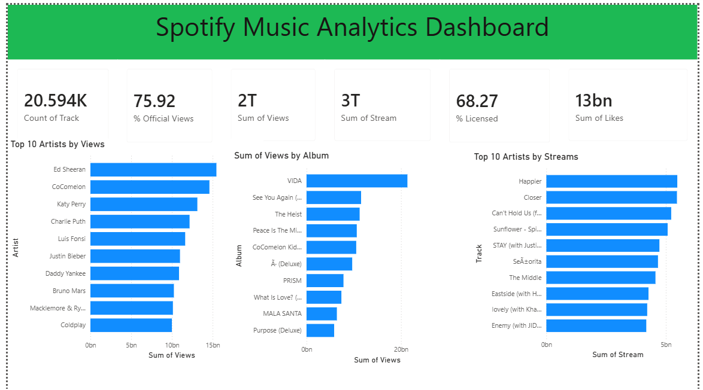

# spotify_data_analysis
End-to-end Spotify data analysis project using SQL, Microsoft Excel, and Power BI. Includes data cleaning, exploratory analysis, KPI reporting, interactive dashboards, and business-focused insights.

# 🎵 Spotify Data Analysis

An end-to-end Spotify data analysis project using **PostgreSQL**, **Microsoft Excel**, and **Power BI**. This project focuses on data cleaning, exploratory data analysis (EDA), SQL querying, and building interactive dashboards to turn raw streaming data into decision-ready insights.

---

## 📌 Project Overview

This project analyzes a Spotify dataset containing information about artists, tracks, albums, streams, views, likes, comments, and audio features.

**Business problem:** A music platform or label needs to understand which factors (licensing, official video presence, audio characteristics) are associated with higher streaming performance, in order to prioritize marketing spend and playlist placement decisions.

The workflow includes:

- Data Cleaning
- Exploratory Data Analysis (EDA)
- SQL Analysis (Easy → Advanced → Interview-Level)
- Interactive Excel Dashboard
- Interactive Power BI Dashboard

---

## 🛠️ Tools Used

- PostgreSQL
- Microsoft Excel (Pivot Tables, Pivot Charts, Slicers)
- Power BI (DAX measures, interactive visuals)

---

## 📁 Project Structure

```text
spotify_data_analysis/
│── README.md
│── SQL/
│   └── spotify_analysis.sql
│── Dataset/
│   └── cleaned_dataset.csv
│── Excel/
│   └── Spotify_Excel_Dashboard.xlsx
│── PowerBI/
│   └── Spotify_Power_BI_project.pbix
└── Screenshots/
    ├── excel_dashboard.png
    └── powerbi_dashboard.png
```

---

## 🔑 Key Insights

- **[385]** tracks in the dataset have crossed 1B+ streams, led by **["Blinding Lights"/"The Weeknd"]**
- Licensed tracks make up **[68]%** of the catalog
- Official videos account for **[76]%** of all tracks
- **[Ed Sheeran]** leads the dataset in total views among top 10 artists, with **[ 15.46]B** views
- Tracks streamed more on Spotify than viewed on YouTube: **[15692]** tracks — suggesting **["a stronger Spotify-native fanbase for these artists"]**
- Average energy-to-liveness ratio above 1.2 was found in **[18797]** tracks, indicating **[Average energy-to-liveness ratio above 1.2 was found in [18797] tracks, indicating a large portion of the catalog favors high-energy, studio-polished production over live-sounding performances — relevant for curating high-intensity playlists (workout, party) versus acoustic/live-session playlists.]**

Recommendation: Prioritize official video production and Spotify-exclusive promotion for high-energy, studio-polished tracks, given their stronger correlation with stream counts — this segment shows the clearest path to maximizing reach with existing content.

---

## 📊 Dashboard Features

**Excel Dashboard**
- Interactive KPI Cards (Total Tracks, Streams, Views, Likes)
- Top 10 Tracks by Views
- Top 10 Artists by Views
- Licensed vs Unlicensed Tracks
- Official vs Non-Official Videos
- Dynamic Filtering using Slicers

**Power BI Dashboard**
- KPI cards including % Official Video and % Licensed (DAX measures)
- Top 10 Artists by Views and by Streams
- Sum of Views by Album
- Highlighted top performer in each ranked chart

🔗 **[Live Power BI Dashboard link — add once published to web]**

---

## 📈 SQL Analysis

The SQL project includes:

### Data Cleaning
- Removed invalid records
- Deleted tracks with zero duration

### Exploratory Data Analysis
- Record counts
- Unique artists and albums
- Album types
- Duration analysis

### SQL Queries
- Basic Queries & Filtering
- Aggregate Functions & GROUP BY
- Window Functions
- Common Table Expressions (CTEs)
- Ranking (ROW_NUMBER, RANK, DENSE_RANK)
- Interview-Level SQL Questions

Full query set: [`SQL/spotify_analysis.sql`](SQL/spotify_analysis.sql)

---

## 📷 Dashboard Preview




---

## 🔄 What I'd Improve Next

- Add Python-based analysis (correlation between audio features and stream counts) for deeper statistical insight
- Build a proper data model with a date/time dimension if timestamp data becomes available
- Add drill-through pages in Power BI for per-artist deep dives
- Automate data refresh instead of static CSV import

---

## 📚 Skills Demonstrated

- SQL (window functions, CTEs, aggregation, ranking)
- Data Cleaning & EDA
- DAX (Power BI measures)
- Microsoft Excel (Pivot Tables, Pivot Charts, Dashboard Design)
- Power BI (Interactive Dashboards, Data Visualization)
- Business problem framing and insight communication

---

## 👤 Author

**Ved Chavan**

GitHub: https://github.com/vedchavan
